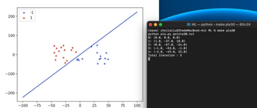
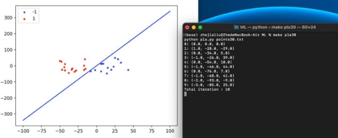
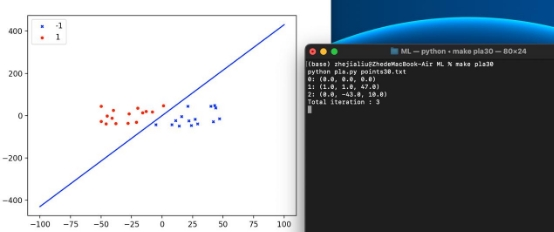
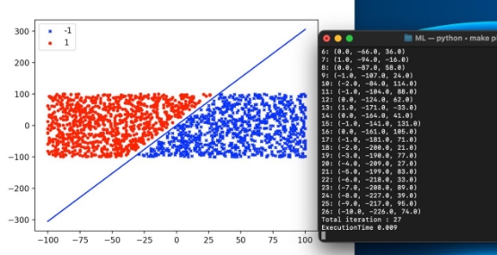
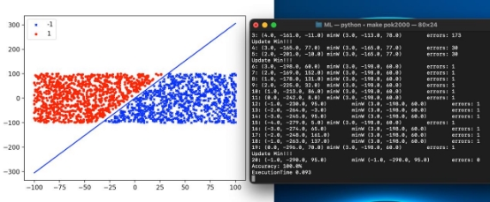
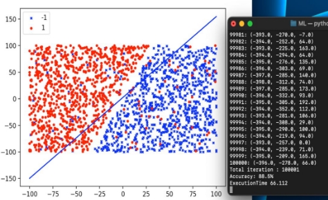
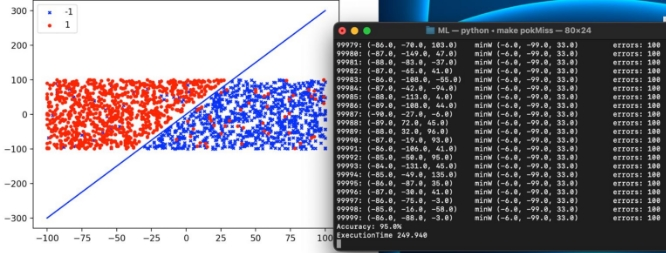

### ML Assignment#1 409410120 資工三 劉哲嘉 Execution description:

#### 檔案說明：f(x) =y= 3x+7 隨機座標範圍： -100< x, y <100

( 1 ) points30.py 創造 15筆正例( 1 ) 15筆反例( -1 ) 以 f(x)線性分割

( 2 ) points2000.py 創造 1000筆正例( 1 ) 1000筆反例( -1 ) 以 f(x)線性分割 

( 3 ) miss.py 創造 1000 筆正例( 1 ) 1000筆反例( -1 ) 兩者都有各 50 筆標示錯誤共 100筆錯誤

( 4 ) pla.pyPLA 演算法，當資料線性可分割會自動停止，不可分割最多迭代 10萬次

( 5 ) pocket.pyPocket 演算法，當資料線性可分割會自動停止，不可分割最多迭代 10萬次

#### 使用 makefile：(in terminal)至檔案目錄下

執行： make data 獲得資料集 points30.txtpoints2000.txtmiss.txt

執行： makepla30PLA 演算法 資料集：points30.txt

執行： makepla2000PLA 演算法 資料集：points2000.txt

執行： makeplaMiss PLA 演算法 資料集：miss.txt

執行： makepok30Pocket 演算法 資料集：points30.txt

執行： makepok2000Pocket 演算法 資料集：points2000.txt

執行： makepokMiss Pocket 演算法 資料集：miss.txt

#### Experimental results:

#### Problem 2 : Generatethedatasamplesthreetimesandcalculatetheaverage numberofiterationswhenPLAhalts.

PLA Average iterations :(5+10+3)/3= 6

#### Problem 3 : ImplementPocketAlgorithmandcomparetheexecutiontimetoPLA onthesamedataset ( 2000data )

PLA : 0.009s

Pocket : 0.093s

PLA : 0.009s <Pocket:0.093s 在可線性分割的資料集下 PLA 的速度會比 Pocket 快

#### Problem 4 : Mislabel50positiveand50negativesamplesbyincorrectlabel.ReporttheaccuracyofPocketAlgorithmbythissettingandthesettingin Problem3.

Accuracy = ( ( samples - errors ) /samples ) \* 100%

在 problem3 中資料集是線性可分割的，因此 Accuracy 可以達到 100％，而在 mislabel 的資料集中有 100筆的錯誤標記，Accuracy 僅有 95%

(2000– 100)/2000=0.95

#### Conclusion:

PLA 在線性可分割的資料集可以找到 f(x) 將資料二分，Pocket 也同樣可以 找到 f(x) 但因為 Pocket 需要將一最佳權重記錄下來，每一次都需要計算錯誤資 料量相比較，所以在線性可分割的資料集中速度會比 PLA 慢，而當資料集不可 分割的狀態，經由實驗觀察在同樣迭代 10萬次的情況，Pocket 的結果會比 PLA 的結果更好

在 mislabel 的資料集

PLA 的 Accuracy =88.5%

Pocket 的 Accuracy =95%

若已知資料集為線性可分割的情況 PLA 速度快且可以二分，但若不可分割的 情況雖然 PLA 的速度較快，但準確率卻低於 Pocket，因此需要針對資料集的狀 況選擇不同的演算法。

#### Discussion:

Pocket 演算法會將最佳的權重記錄下來，而當找到一個較佳權重時一開始的 做法是一直針對這項權重 update，會發現錯誤數量一直降不下來（在線性可分 割的狀況），所以改變作法，變成只先記錄下來，讓權重繼續以隨機的方式更 新，最後再回傳最佳的權重值，避免單一權重持續使用的狀況，使得線性可分 割的資料可以找到 f(x)。
